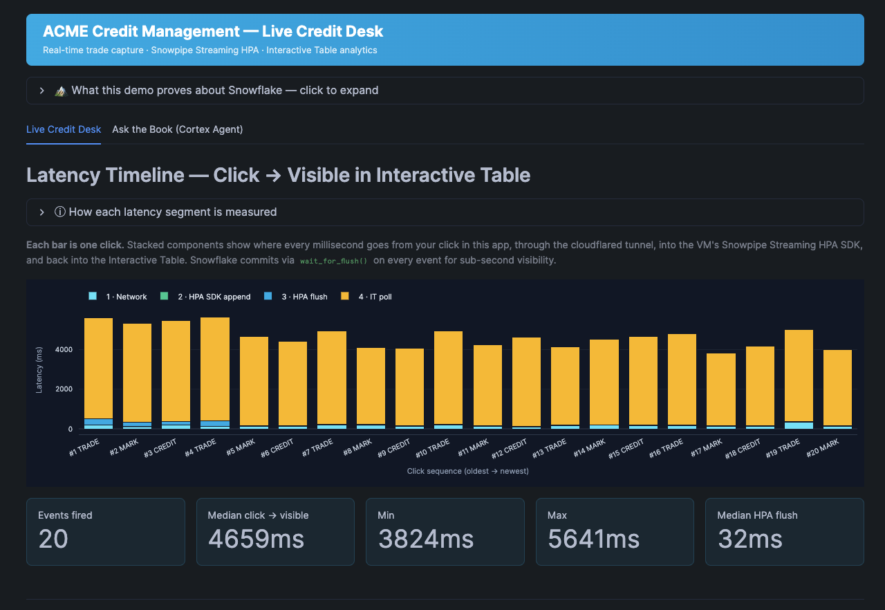
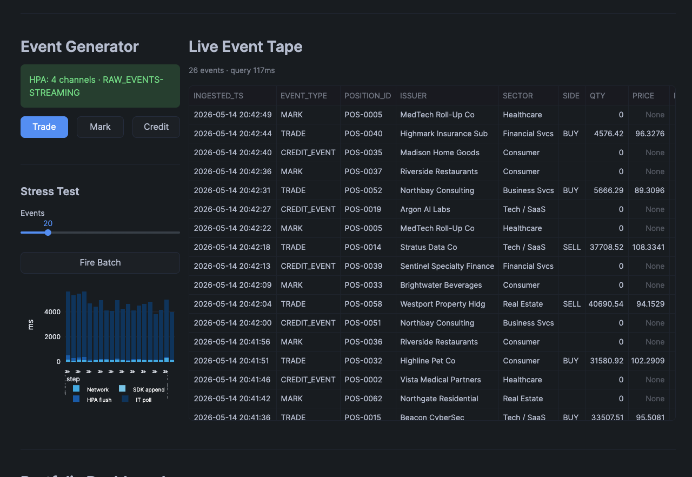
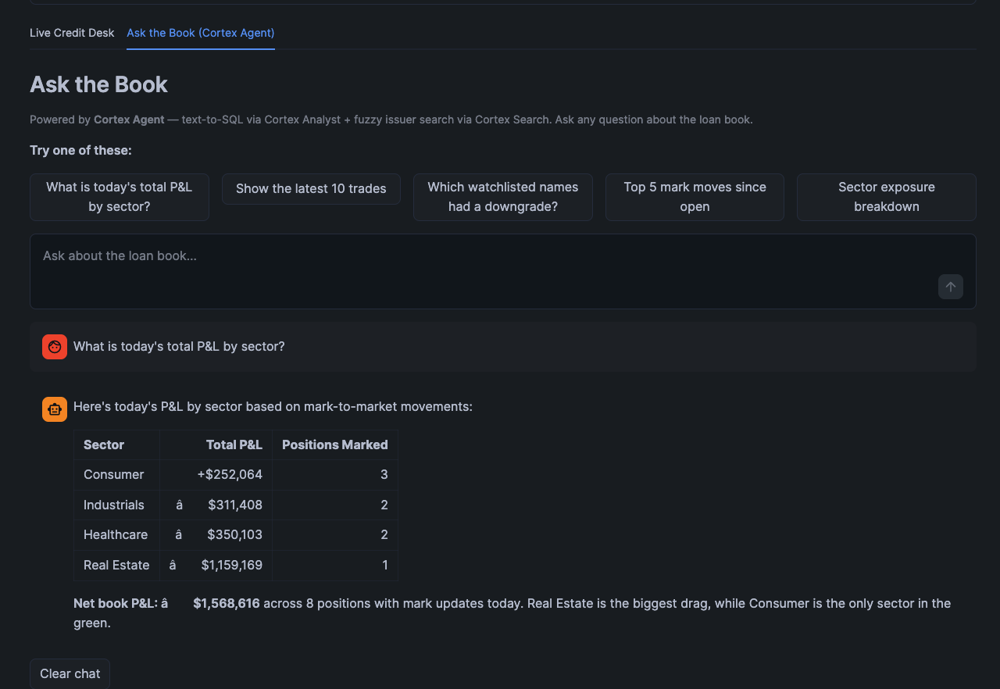
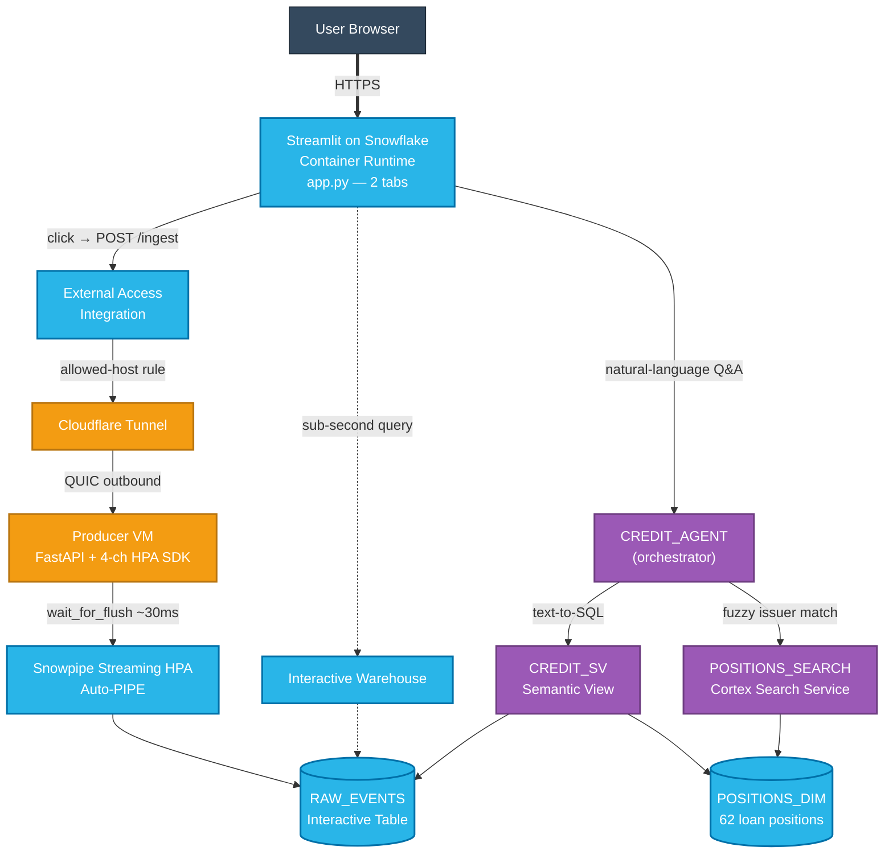

# Real-Time Credit Desk on Snowflake

> Snowpipe Streaming **High-Performance Architecture** + **Interactive Tables** + **Cortex Agent** + **Streamlit on Snowflake** — one account, one auth model, four traditional systems collapsed into one.

A working real-time credit trading desk demo that streams synthetic trade events into Snowflake and serves them through a dashboard, a sub-second Interactive Table, and a natural-language Cortex Agent — all running inside a single Snowflake account, with the only component outside the platform being a small FastAPI producer worker.

### At a glance — honest latency

This demo measures every segment of the click-to-render path. Most "real-time" claims you'll see fold the streaming-layer commit into a single number; this one breaks the segments out so you can see exactly which layer owns which milliseconds.

| Segment | Latency | Whose responsibility |
|---|---|---|
| Snowpipe Streaming HPA `wait_for_flush()` round-trip — commit acknowledgement | **~30ms** | Snowflake (streaming layer) |
| Click → row queryable from any other Snowflake connection | **~150-300ms** | Snowflake (commit + Interactive Table visibility) |
| Click → Interactive Warehouse query returns the new row | **~250-500ms** | Snowflake (Interactive Warehouse) |
| Click → **Streamlit tile visibly re-renders** | **~3-5s** | **Streamlit framework's full-script re-run on every interaction** |
| Cortex Agent natural-language Q&A response | **5-15s** | Cortex orchestration + LLM + warehouse spinup |

**The 30ms figure is the streaming-layer commit only — what Snowflake guarantees.** The 3-5s wall-clock the user sees is Streamlit's overhead, not the streaming path. Replace Streamlit with a thin React/Next.js client polling the same Interactive Table and the perceived loop drops under 500ms. Full latency budget breakdown in [ASSUMPTIONS.md](ASSUMPTIONS.md).

> **Synthetic data only.** ACME Credit Management is a fictional firm. The position book, issuers, trades, marks, and credit events are all generated with `random.seed(2026)` for reproducibility.

## Why we built this

Buy-side trading desks, treasury teams, and any operational dashboard that watches "what just happened" have historically needed **four separate systems** stitched together:

| Capability | Traditional stack | What it costs you |
|---|---|---|
| Real-time row-level ingest | Kafka cluster + Connect framework + schema registry | A team to operate it, $50-500K/yr in licensing + cloud, exactly-once semantics are an unsolved problem in practice |
| Hot serving layer for sub-second reads | Redis / Elasticsearch / a dedicated read replica | A second source of truth, cache-invalidation bugs, replication lag, separate auth model |
| Stream processor for enrichment | Spark Streaming / Flink / Materialize | A third runtime, JVM tuning, watermark complexity |
| Dashboard + ad-hoc Q&A | A frontend app + a BI tool + a separate "ask the data" team | UI engineers, BI license costs, and the business still calls a human when they need a custom answer |

The thesis of this demo: **all four are now collapsed into one Snowflake account.** No Kafka. No Redis. No Spark. No separate frontend server. The only thing outside Snowflake is the producer that emits the events — and only because Snowpipe Streaming's High-Performance SDK is a client library, by design (the producer can be any application — your trading system, an OMS, an OPRA feed, a Kafka Connect target).

What you see when you run this demo:

- A **click in the Streamlit app** triggers a POST through a Cloudflare tunnel to a small FastAPI worker on a GCP VM
- The worker calls **Snowpipe Streaming HPA** with `wait_for_flush()` — a single row commits to Snowflake in ~30ms
- The row lands in an **Interactive Table** (`RAW_EVENTS`) clustered by `(position_id, event_ts)` — concurrent sub-second reads at any scale, no Redis required
- The Streamlit tile re-queries via an **Interactive Warehouse** in ~100-200ms; the row is **queryable from any other connection within ~150ms** of the commit. The visible Streamlit re-render takes another ~3-4 seconds because Streamlit re-runs the entire app script on every interaction — that part is the framework's overhead, not Snowflake's.
- A second tab lets you ask **"What's today's P&L by sector?"** in natural language — the **Cortex Agent** routes through `cortex_analyst_text_to_sql` over a **Semantic View**, plus `cortex_search` for fuzzy issuer lookup, and returns a markdown table

The streaming-layer claim — **commit acknowledgement in ~30ms** and **row queryable in ~150-300ms** — is the part Snowflake guarantees. The full visible loop in this Streamlit UI runs **3-5 seconds** click → tile re-render because Streamlit's full-script re-run on every interaction dominates the wall-clock; swap the front-end for a thin React client polling the same Interactive Table and the entire perceived loop drops under 500ms. The Cortex Agent path runs **5-15s** end-to-end for natural-language Q&A. Every Snowflake-side component is GA. Nothing requires a notebook server, a Kubernetes cluster, or even a single line of frontend code beyond `app.py`.

This is what "real-time on Snowflake" looks like in late 2025 / 2026: a thin client library at the edge, and **everything else managed by Snowflake** — ingest, storage, serving, AI, and UI hosting.

## Screenshots

**Live Credit Desk — Latency Timeline + KPIs.** Each bar is one click in the app. Stacked components show where every millisecond goes from click → cloudflared tunnel → VM Snowpipe Streaming HPA SDK → Interactive Table → query response. The "Median HPA flush" KPI (32ms here) is the actual server-side commit time — wall-clock dominates because the Streamlit re-render after `wait_for_flush()` is what users perceive:



**Live Credit Desk — Event Generator + Live Tape.** Three buttons (Trade / Mark / Credit) generate synthetic events. The 4-channel HPA SDK status block confirms the producer is healthy. The Live Event Tape on the right is a sub-second query against the `RAW_EVENTS` Interactive Table — 26 events, query time 117ms, no caching layer:



**Ask the Book — Cortex Agent.** Natural-language Q&A over the live book. Powered by `cortex_analyst_text_to_sql` over the `CREDIT_SV` semantic view + `cortex_search` over `POSITIONS_SEARCH`. Here, "What is today's total P&L by sector?" routes to the analyst tool, returns a markdown table, and synthesizes a one-line summary:



---

> **Stuck?** See [TROUBLESHOOTING.md](TROUBLESHOOTING.md) for tunnel-restart recovery, EAI rule sync, and common errors.

## What this demo proves

| # | Snowflake product | What it does here | Why it matters |
|---|---|---|---|
| 1 | **Snowpipe Streaming HPA** (GA Sept 2025) | Sub-second row-level ingest via the Python SDK with `wait_for_flush()` for synchronous commit | No staging files, no Kafka cluster, exactly-once delivery with **~30ms server-side commit** |
| 2 | **Interactive Tables** | Hot serving layer for `RAW_EVENTS`, clustered by `(position_id, event_ts)` | Sub-second concurrent reads at any scale — replaces a Redis cache |
| 3 | **Interactive Warehouses** | Dedicated compute SKU bound to Interactive Tables | Predictable sub-second query latency for the dashboard tiles |
| 4 | **Streamlit on Snowflake — Container Runtime** | Single-file UI with External Access Integration to the producer VM | No frontend server to operate, no auth gate to wire up |
| 5 | **Cortex Agent** (Analyst + Search) | Natural-language Q&A over the live book | Replaces a dashboard team — "Show me Apollo's exposure" → table response in 5-10s |
| 6 | **Semantic View** | Metadata-rich layer (sample values, synonyms, search bindings) | No model training, no vector DB, no fine-tuning |

The producer side runs **outside Snowflake** (GCP VM) because Snowpipe Streaming HPA does not yet support Snowpark Container Services. Everything else — serving, analytics, AI — is in-Snowflake.

---

## Architecture

### ASCII view (works in every terminal + every markdown viewer)

```
                            USER BROWSER
                                 │
                                 ▼ (HTTPS via Snowsight)
   ╔══════════════════════════════════════════════════════════════════╗
   ║  STREAMLIT ON SNOWFLAKE  (Container Runtime)                     ║
   ║   • Live Credit Desk tab        • Ask the Book tab               ║
   ╚══════════════════════════════════════════════════════════════════╝
        │ click "New Trade / Mark / Credit"           │ natural-language
        │ POST /ingest                                │ question
        │ (via External Access Integration)           │
        ▼                                             ▼
   [ Cloudflare Tunnel ]                       ┌────────────────────┐
        │                                      │  CREDIT_AGENT      │
        ▼                                      │  ├─ analyst tool   │
   [ Producer VM (any cloud)        ]          │  └─ search tool    │
   [   FastAPI + 4-channel HPA SDK  ]          └─────────┬──────────┘
        │ wait_for_flush                                 │
        │ keypair JWT, ~30ms commit                      │ text-to-SQL
        ▼                                                ▼
   ┌─────────────────────────────────┐         ┌────────────────────┐
   │ Snowpipe Streaming HPA Auto-PIPE│         │  CREDIT_SV         │
   └────────────────┬────────────────┘         │  Semantic View     │
                    │                          │  + POSITIONS_SEARCH│
                    ▼                          │  Cortex Search     │
   ┌──────────────────────────────────────┐    └─────────┬──────────┘
   │ RAW_EVENTS   Interactive Table       │              │
   │ POSITIONS_DIM   (62 loan positions)  │ ◄────────────┘
   └────────────────┬─────────────────────┘   (SQL execute via std WH)
                    │ sub-second query
                    ▼
   ┌──────────────────────────────────────┐
   │ Interactive Warehouse → live tile    │ ───┐
   │ refresh in Streamlit UI              │    │ back to user browser
   └──────────────────────────────────────┘ ◄──┘
```

**Three flow paths overlaid above:**

1. **Click loop** (left column): user click → SiS → EAI → tunnel → VM → HPA SDK → Auto-PIPE → `RAW_EVENTS`. Server-side commit ~30ms.
2. **Live tile re-query** (bottom of left column): SiS → Interactive Warehouse → `RAW_EVENTS`. Sub-second concurrent reads.
3. **Cortex Agent path** (right column): SiS → `CREDIT_AGENT` → `cortex_analyst_text_to_sql` over `CREDIT_SV` (or `cortex_search` over `POSITIONS_SEARCH`) → SQL against the same tables. 5-15s end-to-end.

### Mermaid view (renders on GitHub, GitLab, VS Code, most markdown viewers)



**Color legend** — orange = outside Snowflake (Cloudflare + producer VM), blue = Snowflake-managed data + UI, purple = Cortex AI layer, dark = end user.

**Edge styles** — solid arrows are user-driven actions (click, ask), dotted arrows are background re-renders (live tile re-querying after each commit).

### The single takeaway

**The only piece outside Snowflake is the producer VM.** It exists wherever your trading system / OMS / Kafka Connect / market data feed already runs. Once a row is over the wire to Snowpipe Streaming HPA, every downstream concern (durability, fan-out, query, AI) is Snowflake's problem.

For the per-segment latency breakdown, see the [At a glance — honest latency](#at-a-glance--honest-latency) table at the top of this README. The 30ms commit is the streaming-layer guarantee; the 3-5s the user perceives is Streamlit's full-script re-run cycle, not the streaming path.

---

## Quickstart

### 0. Configure once — `.env`

All scripts and the Streamlit app read config from a single `.env` file.

```bash
cp .env.example .env
# Edit .env — set the 5 values below
```

| Variable | What it is |
|---|---|
| `SNOWFLAKE_CONNECTION` | Your `snow connection list` connection name (must have ACCOUNTADMIN) |
| `SNOWFLAKE_ACCOUNT` | Your account locator (e.g. `MYORG-MYACCOUNT`) |
| `VM_NAME` / `VM_ZONE` / `VM_STATIC_IP` | Your GCP VM (or any cloud VM) details |
| `INGEST_TUNNEL_HOST` | Public DNS hostname routing to VM:8080 (e.g. `ingest.example.com`) |
| `INGEST_API_KEY` | Strong random shared secret (auto-generated by `setup.sh`) |

### 1. Run the interactive setup script (recommended)

```bash
./setup.sh
```

Walks you through filling in `.env` with auto-detection where possible:
- Lists available `snow connection list` entries to pick from
- Lists `gcloud compute instances list` if `gcloud` is installed
- Generates a strong random `INGEST_API_KEY` if you don't supply one

### 2. Create Snowflake objects

```bash
snow sql -f setup.sql         --enable-templating NONE --connection "$SNOWFLAKE_CONNECTION"
snow sql -f semantic_view.sql --enable-templating NONE --connection "$SNOWFLAKE_CONNECTION"
```

> **Why `--enable-templating NONE`?** snow CLI's default Jinja templater intercepts the `&L` substring inside the agent's "P&L" instruction text and aborts with `'L' is undefined`. The flag turns off Jinja, leaving SQL pass-through. The same flag is required for `semantic_view.sql` (CA extension JSON contains `&` chars).

Creates: `CREDIT_DEMO` schema, `RAW_EVENTS` Interactive Table, `POSITIONS_DIM` (62 seeded positions), `CREDIT_DEMO_WH` + `CREDIT_DEMO_INT_WH`, `CREDIT_INGEST_RL` role, `CREDIT_INGEST_EAI` external access integration, `CREDIT_POOL` compute pool, `CREDIT_STAGE`, `APP_CONFIG` runtime config table, `POSITIONS_SEARCH` Cortex Search service, `CREDIT_SV` semantic view, `CREDIT_AGENT` Cortex Agent. Idempotent — safe to re-run.

### 3. Generate a service-user keypair

Snowpipe Streaming requires keypair JWT auth (not PAT/OAuth):

```bash
mkdir -p ~/.snowflake/keys
openssl genrsa 2048 | openssl pkcs8 -topk8 -inform PEM -out ~/.snowflake/keys/credit_ingest.p8 -nocrypt
openssl rsa -in ~/.snowflake/keys/credit_ingest.p8 -pubout -out ~/.snowflake/keys/credit_ingest.pub

# Register with Snowflake (paste public key, minus header/footer, into the SQL):
snow sql --connection "$SNOWFLAKE_CONNECTION" -q "
CREATE USER IF NOT EXISTS CREDIT_INGEST_USR
  TYPE = SERVICE
  RSA_PUBLIC_KEY = '<paste-public-key-here>'
  DEFAULT_ROLE = CREDIT_INGEST_RL;
GRANT ROLE CREDIT_INGEST_RL TO USER CREDIT_INGEST_USR;
"
```

### 4. Deploy the VM ingest worker

> **Pick one of the four onboarding paths below.** All four end with a working `https://your-tunnel-host` endpoint that the Streamlit app can hit.

#### Path A — Quick-tunnel (FASTEST — no Cloudflare account needed, ~2 min)

Ephemeral `https://<random>.trycloudflare.com` URL via `cloudflared tunnel --url`. Perfect for a quick smoke test or hackathon. **The URL changes on every cloudflared restart** — see [TROUBLESHOOTING.md § Quick-tunnel handling](TROUBLESHOOTING.md) for recovery.

```bash
gcloud compute scp --recurse vm-ingest/ "$VM_NAME":/opt/credit-ingest --zone "$VM_ZONE"
gcloud compute ssh "$VM_NAME" --zone "$VM_ZONE" -- \
  "cd /opt/credit-ingest && docker compose --profile quick up -d"

# Sync the new URL into Snowflake (run this any time the URL changes):
bash vm-ingest/sync-quick-tunnel.sh
```

**Where it runs:** cloudflared is a sidecar container *on the VM*, in the same docker-compose network as `credit-ingest`. Your laptop is not on the data path.

**Tradeoffs:** Hostname is ephemeral and changes every restart, no DNS control. Use for demos and POCs only. **For anything customer-facing, use Path B (named tunnel)** — it gives you a stable hostname that survives restarts.

#### Path B — Compose-embedded named tunnel (RECOMMENDED for real demos, ~5-10 min)

Stable hostname (e.g. `ingest.example.com`) via a Cloudflare Zero Trust named tunnel. Requires a free Cloudflare account.

```bash
# 1. In Cloudflare Zero Trust dashboard → Networks → Tunnels → Create tunnel
#    Choose "cloudflared" connector. Copy the tunnel token.
# 2. Add Public Hostname: ingest.example.com → http://credit-ingest:8080
# 3. Paste the token into vm-ingest/.env
echo "CLOUDFLARE_TUNNEL_TOKEN=eyJ..." >> vm-ingest/.env

# 4. SSH to your VM and bring up the stack
gcloud compute scp --recurse vm-ingest/ "$VM_NAME":/opt/credit-ingest --zone "$VM_ZONE"
gcloud compute ssh "$VM_NAME" --zone "$VM_ZONE" -- \
  "cd /opt/credit-ingest && docker compose --profile tunnel up -d"
```

#### Path C — Bootstrap script (interactive, ~15 min)

Run on a fresh Ubuntu VM. Installs Docker + cloudflared, walks through `cloudflared tunnel login`, creates a named tunnel, configures DNS.

```bash
gcloud compute ssh "$VM_NAME" --zone "$VM_ZONE"
# On the VM:
curl -sL https://raw.githubusercontent.com/<your-fork>/main/vm-ingest/vm-bootstrap.sh -o bootstrap.sh
bash bootstrap.sh
# Follow the prompts. Choose option 1 (Compose) or 2 (Host-installed cloudflared).
```

#### Path D — Terraform (full IaC, ~10 min)

```bash
cd vm-ingest/terraform
cp terraform.tfvars.example terraform.tfvars   # edit with your project + Cloudflare zone
gcloud auth application-default login
export CLOUDFLARE_API_TOKEN="<from-dash.cloudflare.com/profile/api-tokens>"
terraform init && terraform apply
echo "INGEST_TUNNEL_HOST=$(terraform output -raw tunnel_hostname)" >> ../../.env
```

### 5. Deploy the Streamlit app

```bash
./deploy.sh
```

This sources `.env`, MERGEs `INGEST_TUNNEL_HOST` + `INGEST_API_KEY` into `APP_CONFIG`, uploads files, and does `DROP STREAMLIT` + `CREATE STREAMLIT` + `ALTER ADD LIVE VERSION FROM LAST` (forces a fresh container — Container Runtime caches `app.py` otherwise).

The script prints the Streamlit URL when done. Cold start is 30-60s on first open.

---

## Multi-tenancy / shared Snowflake accounts

Several objects in this demo are **account-level** (not schema-scoped) and will collide if two SEs install the demo on the same Snowflake account simultaneously. If that's a possibility, find/replace the names below before running `setup.sql`:

| Object | Why account-level | Default name |
|---|---|---|
| External Access Integration | Snowflake EAIs are always account-scoped | `CREDIT_INGEST_EAI` |
| Network Policy (optional, see TROUBLESHOOTING.md) | Per-user override, but the policy itself lives at account scope | `CREDIT_INGEST_NP` |
| Service User | Account-scoped principal | `CREDIT_INGEST_USR` |
| Role | Account-scoped principal | `CREDIT_INGEST_RL` |
| Compute Pool | Account-scoped (SiS Container Runtime requirement) | `CREDIT_POOL` |
| Warehouses | Account-scoped | `CREDIT_DEMO_WH`, `CREDIT_DEMO_INT_WH` |

A simple per-tenant rename (e.g. `CREDIT_INGEST_EAI` → `CREDIT_INGEST_EAI_<your-initials>`) avoids collisions. The schema-scoped objects (`SNOWFLAKE_EXAMPLE.CREDIT_DEMO.*`) and the Streamlit app itself are isolated by schema and don't need renaming. `teardown.sh` drops everything by exact name so be careful: a renamed install requires a renamed teardown.

---

## File map

| Path | Purpose |
|---|---|
| `app.py` | Streamlit UI — generator, latency timeline, live tape, dashboard, Cortex Agent chat |
| `setup.sh` | Interactive `.env` writer with auto-detection |
| `deploy.sh` | Streamlit deploy (sources `.env`, populates `APP_CONFIG`, redeploys SiS) |
| `setup.sql` | All Snowflake DDL — schema, tables, warehouses, role, EAI, agent, search, semantic view |
| `semantic_view.sql` | Semantic View definition for Cortex Analyst |
| `ingest.py`, `queries.py`, `observability.py` | App-side helpers |
| `vm-ingest/` | GCP VM producer (FastAPI + 4-channel HPA SDK + observe-agent sidecar) |
| `vm-ingest/docker-compose.yml` | Containers: ingest-worker + observe-agent + cloudflared |
| `vm-ingest/vm-bootstrap.sh` | One-shot Ubuntu setup script |
| `vm-ingest/terraform/` | GCP + Cloudflare IaC module |
| `ASSUMPTIONS.md` | Architecture decisions, latency budget, failure modes |
| `TALK_TRACK.md` | Demo script template (60-second narrative + 6-beat live demo) |
| `LEAVE_BEHIND.md` | One-page customer summary template |
| `RUN_DEMO.md` | Pre-flight checklist + recovery runbook |

---

## Demo script (8 minutes)

| Minute | Action | What to point out |
|---|---|---|
| 0:00 | Open the dashboard | 62-position credit book pre-loaded |
| 0:30 | Expand "What this demo proves" | 6 Snowflake products, one platform |
| 1:30 | Click **New Trade** | Latency timeline appears — 4 bars showing each step |
| 2:30 | Click 5x rapidly | Bars stack on the chart, each ~3-5s wall-clock with HPA flush <50ms — point out that the network + HPA layer is sub-100ms; the rest is Streamlit re-running the full app on every click |
| 4:00 | Switch to **Ask the Book** tab | "What is today's P&L by sector?" |
| 5:00 | Fuzzy issuer search | "Show me Apollo's exposure" — Cortex Search routes |
| 6:00 | Combined query | "Has Cascade Industrial been re-marked recently?" |
| 7:00 | The closer | Fire a trade, switch tabs, ask "What was our most recent trade?" — same row, two interfaces. Streaming commit is ~30ms; the agent's text-to-SQL answer takes 5-10 seconds to compose, but the row was queryable in Snowflake within ~150ms of the click |

See [TALK_TRACK.md](TALK_TRACK.md) for the full narrative + Q&A prep.

---

## What's not in this demo (open extensions)

- **Cortex AI functions** on `RAW_EVENTS` (`AI_CLASSIFY`, `AI_SENTIMENT`) for credit-event categorization — straightforward to add
- **Native App** packaging — turn this into an in-Marketplace app
- **Multi-region replication** of `RAW_EVENTS` for cross-cloud read latency
- **Iceberg** target instead of native — same HPA SDK, different target

---

## Repository Owner

- **Owner:** John Kang (john.kang@snowflake.com / [@sfc-gh-jkang](https://github.com/sfc-gh-jkang))
- **License:** Apache-2.0 — see [LICENSE](LICENSE)
- **Pre-publication review:** CASEC ticket pending. This repo will remain private until the open-source-review (CASEC + LIFT) approval lands; once approved, the README will be updated with the ticket number and the GitHub repo flipped public.

## License

Apache License, Version 2.0. See [LICENSE](LICENSE).

## Disclaimer

This is a Snowflake Sales Engineering sample, not an officially supported Snowflake product. The position book, issuers, trades, marks, and credit events are all synthetic. ACME Credit Management is fictional. Use at your own risk.
