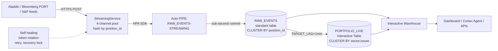

# Live Credit Desk Demo — Talk Track
**Audience:** [Customer name] — private credit / asset management firm
**Date:** [Demo date]
**Speaker:** [Your name], Snowflake SE

---

## 60-second narrative (open with this)

> "On a credit desk today, every meaningful event — a new trade, a re-mark, a downgrade — lives in spreadsheets, broker emails, and a portfolio system that snapshots overnight. By the time it reaches your dashboard, the moment is gone, and the conversation with your CIO is reactive instead of pre-emptive.
>
> What I'm about to show you is what real-time looks like when the loan tape, the marks, and the credit events flow into one system that your analysts and your AI tools can query in sub-second. I'll click 'New Trade,' and Snowflake will commit it via Snowpipe Streaming in roughly 30 milliseconds — visible to any other Snowflake connection within a few hundred ms, with the full audit trail intact and exactly-once delivery guaranteed. The dashboard tile you're watching takes ~3–5 seconds to re-render because Streamlit re-runs the whole script on every interaction — that latency is the UI framework, not the streaming layer."

## What you're about to see

| Pane | What | Tech |
|------|------|------|
| Left  | Generator buttons + live event tape | Snowpipe Streaming HPA Python SDK from a remote ingest worker → `RAW_EVENTS` standard table |
| Middle | "Latest mark per issuer" — sub-second updates | View on `RAW_EVENTS` queried by **Interactive Warehouse** |
| Right | Sector exposure / hourly trades / credit watchlist | **Interactive Table** `PORTFOLIO_LIVE` (1-min lag, sub-second query response) |

## Demo script (8-10 min)

### Beat 1 — "The book"
- Open the dashboard cold. ~80 positions across 8 sectors, $2.8B total par. Names that look like a private credit book — Apollo Health 1L, Stratus Data 2L Mezz, Cascade Industrial Unitranche.
- Point out: "All of this is queried via an **Interactive Warehouse** — it's the new SKU that gives you sub-second response times even when 40 of your analysts hit the same dashboard concurrently. No more 'spinning wheel' on the morning kickoff call."

### Beat 2 — "The trade lands"
- Click **Generate Trade**. Show the latency badge — typically 30–200ms HPA flush (the Snowflake commit), and the new row is queryable from any other connection within a few hundred ms. The Streamlit tile itself takes ~3–5s to visibly re-render because the framework re-runs the whole script on every click — call this out so the customer doesn't conflate "what Snowflake did" with "what Streamlit did".
- Highlight the **partition number** in the response: "Your desk cares deeply about per-position ordering — the StreamingService routes by `position_id`, so all events for a given loan land on the same channel and stay in order. That's how you preserve the audit trail for fraud, compliance, and balance reconstruction."

### Beat 3 — "The mark moves"
- Click **Mark Update** on a watchlisted name (e.g., Apollo Health 1L). Mark drops 75 bps.
- Right-pane sector tile updates within ~60s — "this is the Interactive Table aggregating across the book. P&L recomputes, sector exposure shifts, all without you running a query manually."

### Beat 4 — "The credit event"
- Click **Credit Event** on a different name. Rating downgrade B+ → B.
- Watchlist count ticks up. Tape shows the event with full audit metadata.
- "If your team has a Cortex Agent monitoring `PORTFOLIO_LIVE`, you can wire it to alert your CIO on Slack the moment a B+ becomes B — no overnight batch job, no Tuesday morning surprise."

### Beat 5 — "Throughput"
- Toggle **Stress mode**. Fire 300 events in 30s.
- Tape stays lively, dashboard tiles keep up. "This is one channel. The HPA SDK supports up to 10 GB/s per table. For your real loan tape — even for a 200-fund book with daily mark cycles — you'll never come close to the ceiling."

### Beat 6 — "The architecture"
Show the architecture diagram (see below). Walk through:
1. **Source** — your existing producers (BlackRock Aladdin export, Bloomberg PORT marks, S&P/Moody's webhook feeds) → HTTPS POST or direct SDK
2. **Ingest tier** — `StreamingService` (4-channel pool, hash-routes by position_id, self-healing on token rotation, retries with bounded budget)
3. **Snowpipe Streaming HPA** — auto-PIPE writes to standard `RAW_EVENTS` table, sub-second commit, exactly-once via offset tokens
4. **Interactive Table** — `PORTFOLIO_LIVE` refreshes every minute, clustered by (sector, issuer)
5. **Interactive Warehouse** — sub-second concurrent reads from analysts, agents, and APIs

## Architecture diagram (Mermaid — paste into your follow-up email)



## What the customer should walk away believing

1. **Real-time is shippable** — not a 6-month consulting engagement. We stood the entire pipeline up in a few hours of a single SE's time on a SE demo account.
2. **You don't need Kafka** to get streaming — the HPA Python SDK + a small FastAPI worker is enough for most asset managers under 500 employees.
3. **Snowflake commits in ~30 ms; the UI re-render is the slow part** — the streaming layer (`wait_for_flush`) acks in ~30 ms, the row is queryable from any other Snowflake connection within ~150–300 ms, and an Interactive Warehouse returns it in ~250–500 ms. The ~3–5s click → tile re-render in this demo is the Streamlit framework's full-script re-run, not Snowflake. Either way, both are dramatically faster than overnight batch and hourly Bloomberg refresh.
4. **Interactive Tables are the layer your AI tools want** — they make Cortex Agent / Cortex Analyst feel snappy even when the underlying compute is solving real questions.
5. **Snowflake handles the boring parts** — ordering, exactly-once, schema evolution, retries, recovery. Your team writes the producer logic; we do the rest.

## Anticipated questions + answers

**Q: How do we wire our actual loan tape from [Aladdin / Pulse / Burgiss / etc.]?**
A: Most of these have CSV/API exports. We'd write a small Python worker (~150 LOC, the StreamingService class is the bulk) that reads the export and pushes via HPA SDK. For Aladdin specifically there's an event-stream feed we can tap directly. We can size this engagement for you.

**Q: What's the cost model?**
A: Snowpipe Streaming HPA is throughput-based ($credits per uncompressed GB ingested). Interactive Warehouse is per-second, suspends after 24h idle (vs 1min for standard WH — by design, since it's holding hot caches). For a private credit book your sized at ~80 positions × 50 events/day, the streaming cost is in the noise; the Interactive WH cost depends on dashboard concurrency.

**Q: Who owns the producer code?**
A: You do. We provide the StreamingService reference implementation (PR-ready, tested) and the operational runbook. Your engineering team or a Snowflake Professional Services engagement can productionize it.

**Q: How does this compare to [Snowflake's Dynamic Tables / Materialized Views / Streams]?**
A: Dynamic Tables and MVs have a 1-minute lag floor and aren't optimized for sub-second concurrent reads. Streams are change-tracking, not query-serving. Interactive Tables are purpose-built for the dashboard/AI access pattern. You'll likely use all four in different parts of your stack.

**Q: Security / compliance for a credit fund?**
A: Snowflake is SOC 2 Type II, ISO 27001, HIPAA, PCI-DSS — the standard set. For a credit fund the relevant ones are SOC 2 + your own SEC custody/recordkeeping requirements. Snowflake's Time Travel + Fail-safe gives you the recordkeeping retention story for free.

**Q: Disaster recovery?**
A: Replication groups + failover. We can set up a us-east-1 → us-west-2 BC/DR pair on Business Critical edition. You'd see 5min RPO, ~30min RTO depending on size.

## Follow-up offer

> "Your loan tape is small enough that we could stand up a real proof-of-concept against your actual data in 2 weeks of paired Snowflake + your team time. The deliverable would be: your loan tape, your marks, your credit events flowing into Snowflake live, with a Streamlit prototype your team can iterate on, plus a Cortex Agent that answers 'what changed since yesterday morning's risk meeting' in plain English. If that sounds useful, let's get a 30-min scoping call on calendar this week."

## Demo-day pre-flight (run these ~10 min before the demo)

```bash
# 1. Refresh Snowhouse + <your-connection> ID tokens
snow connection test -c <your-connection>

# 2. Start the gcloud port-forward (keep running in dedicated tmux/terminal)
gcloud compute ssh <your-vm-name> \
  --zone us-central1-c --tunnel-through-iap \
  -- -L 8080:localhost:8080 -N

# 3. Verify VM ingest worker
curl http://localhost:8080/health
# Should show channels=4, status=healthy

# 4. Pre-warm warehouses
snow sql -c <your-connection> -q "USE WAREHOUSE CREDIT_DEMO_INT_WH; SELECT 1;"
snow sql -c <your-connection> -q "USE WAREHOUSE CREDIT_DEMO_WH; SELECT 1;"

# 5. Force a refresh of PORTFOLIO_LIVE (so first query is hot)
snow sql -c <your-connection> -q "ALTER INTERACTIVE TABLE SNOWFLAKE_EXAMPLE.CREDIT_DEMO.PORTFOLIO_LIVE REFRESH;"

# 6. Start Streamlit
cd ~/Documents/vscode/credit-demo
SNOWFLAKE_CONNECTION_NAME=<your-connection> CREDIT_INGEST_URL=http://localhost:8080 \
  uv run streamlit run app.py

# 7. Open browser to http://localhost:8501

# 8. Fire 3 test events to warm caches and verify pipeline
# (use the Generator buttons in the app)
```

## If something breaks during the demo

| Failure | Recovery |
|---------|----------|
| VM tunnel drops | Re-run `gcloud compute ssh ... -L 8080:localhost:8080 -N` in another terminal. Streamlit auto-retries. |
| HPA SDK channel error | StreamingService self-heals. If 3 retries fail, toggle to "Direct INSERT (fallback)" mode in app sidebar. |
| Interactive Warehouse cold | First query takes 3-5s. Pre-flight step 4 should prevent this. |
| `RAW_EVENTS` doesn't show new rows | Check `curl localhost:8080/health` — if 503, restart on VM: `cd /opt/credit-ingest && docker-compose restart credit-ingest` |
| Demo-killer: <your-connection> login expired | `snow connection test -c <your-connection>` → browser SSO → done |
